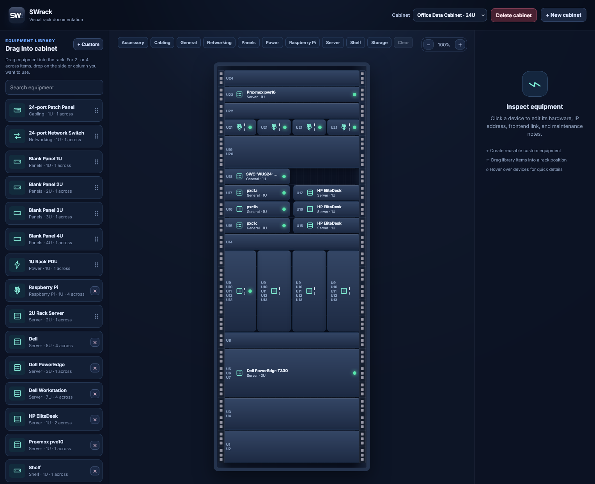

# SWrack

**SWrack** is a self-hosted visual rack and data-cabinet documentation tool.
It provides interactive rack elevations, custom equipment templates, image and
PNG icon uploads, live ping checks, category highlighting, rack blank panels,
0.5U placements, and persistent Docker storage.

<details> <summary><strong>Screenshot</strong></summary> <br> <p align="center"> <a href="swrack_screenshot.png">  </a> </p> </details>

## Source snapshot

This repository snapshot represents **SWrack v26**, including every completed
application upgrade from the original Cabinet Canvas project.

Included source:

- Svelte web application
- Fastify / Prisma API
- Docker Compose deployment
- PostgreSQL schema and seed data
- SWrack logo, favicon, Apple touch icon, and web manifest
- Automatic ping monitoring and status LEDs
- Category highlights and custom category creation
- 0.5U custom equipment support
- Firefox-safe in-app management dialogs

## Quick start

```bash
cp .env.example .env
# Edit .env and replace the example PostgreSQL password.
# Set APP_PORT and CORS_ORIGIN to the address/port you intend to use.

docker compose up -d --build
```

Visit the configured address, for example:

```text
http://localhost:8088
```

For your existing deployment port, set `APP_PORT` and make `CORS_ORIGIN`
use the same host/port combination.

## Important

This is a **source-only** archive. It intentionally excludes:

- `.env` and any passwords/secrets
- PostgreSQL database contents
- Uploaded image/icon assets from a running deployment
- Docker volumes
- `node_modules`
- Vite build output

This makes it safe to store in Git or use as a clean deployment source.
Back up Docker volumes separately when you need a complete data backup.
